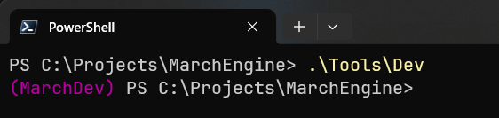
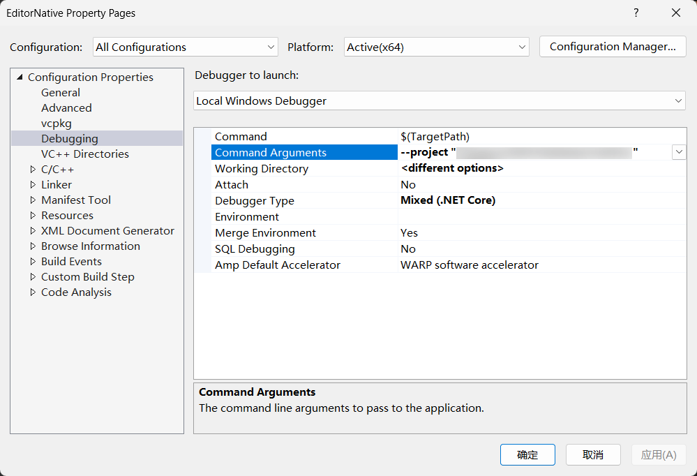

# Build

先劝退一下。项目现在处于玩具阶段，代码也比较复杂，还经常有 Breaking Change，而且我没空写非常详细的文档，请做好心理准备。

## 要求

- Windows x64
- Windows SDK 10.0
- [Visual Studio 2022](https://visualstudio.microsoft.com/zh-hans/vs/) 及必要的 C++ 和 C# 组件

## 生成项目

使用 cmd 或者 PowerShell 下载项目

``` shell
git clone --recursive https://github.com/stalomeow/MarchEngine.git
```

进入项目目录

``` shell
cd MarchEngine
```

输入下面的命令，进入开发环境

``` shell
.\Tools\Dev
```

以 PowerShell 为例，执行成功后会在前面显示 `(MarchDev)`

<p align="center"></p>

在开发环境中，可以使用 `mar` 命令在引擎的根目录生成 MarchEngine.sln

```shell
mar # 这实际上是 mar vs2022 的简写
```

第一次使用 `mar` 命令时，会构建 Premake，大概需要 15 秒

## 项目配置

打开 EditorNative 的属性页面，配置调试参数

<p align="center"></p>

### 命令行参数

必须提供的参数

- `--project`：指定项目的路径，只要给一个合法的路径就行，文件夹不存在则会自动创建

图形调试参数，这几个是可选且互斥的，最多只能给定一个

- `--renderdoc`：启动时加载 RenderDoc，之后点击编辑器上方的相机按钮就能截帧
- `--pix`：启动时加载 PIX，之后点击编辑器上方的相机按钮就能截帧
- `--d3d12-debug-layer`：启用 D3D12 的调试层，能提供详细的错误信息，但运行会变卡
- `--nvaftermath`：启用 NVIDIA Nsight Aftermath SDK 的基本功能
- `--nvaftermath-full`：启用 NVIDIA Nsight Aftermath SDK 的所有功能

### 调试器

默认使用 `Mixed (.NET Core)`，它可以同时调试 C++ 和 C# 代码。这个调试器貌似是 Visual Studio 独占的，所以我才用它开发。

只有加载完 .NET Runtime，`Mixed (.NET Core)` 调试器才能正常工作，如果在这之前的 C++ 代码出错了需要调试，可以临时改用 `Native Only` 调试器。

## 其他

在开发环境中，`mar` 命令还有其他用法：

- 清理生成的文件

    ``` shell
    mar clean
    ```

- 快速创建文件

    ``` shell
    mar touch a/b/c.txt
    ```
