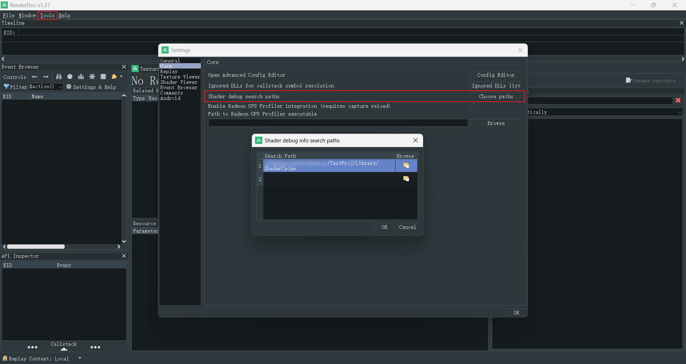
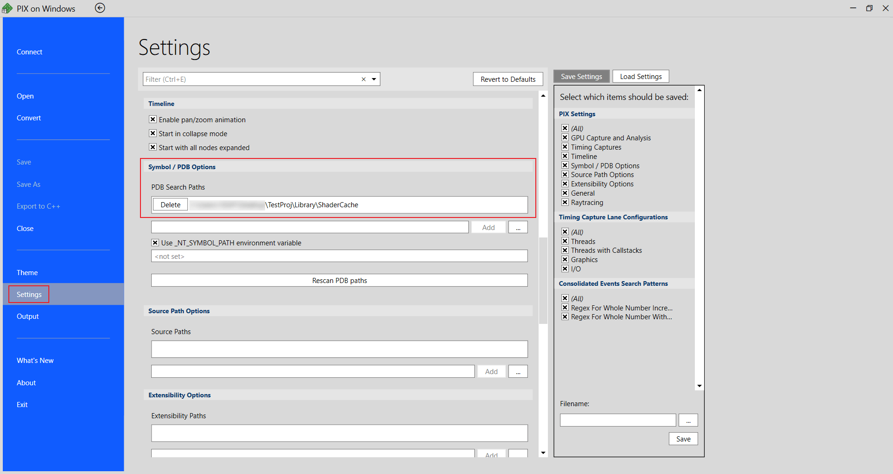
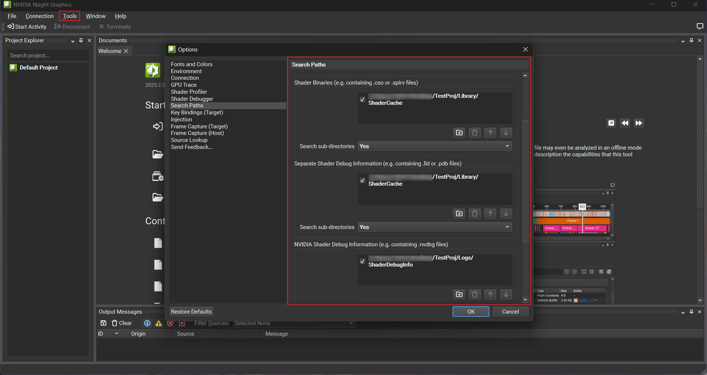

# Debugging Shaders

Shader 的编译结果被保存在项目的 `Library/ShaderCache` 目录中，包括字节码和 PDB。

## RenderDoc

在 Tools > Settings > Core 中找到 Shader debug search paths，点击 Choose paths 将 ShaderCache 的路径添加进去。之后，RenderDoc 就能自动加载 Shader 的调试信息。

## PIX

在 File > Settings > Symbol / PDB Options 中找到 PDB Search Paths，将 ShaderCache 的路径添加进去。之后，PIX 就能自动加载 Shader 的调试信息。

## Nsight Graphics

在 Tools > Options > Search Paths 中

- 找到 Shader Source，将 Shader 源文件的路径添加进去，例如引擎的 `MarchEngine/Source/Shaders/Public`
- 找到 Shader Binaries 和 Separate Shader Debug Information，将 ShaderCache 的路径添加进去
- 找到 NVIDIA Shader Debug Information，将项目的 `Logs/ShaderDebugInfo` 添加进去

将所有的 Search sub-directories 设置为 Yes。之后，Nsight Graphics 就能自动加载 Shader 的调试信息。

## Nsight Aftermath

如果启用了 Nsight Aftermath，当 GPU 崩溃后，会在项目的 `Logs` 目录下生成 Crash Dump。如果启用了 Nsight Aftermath 的全部功能，并且按照前面的方法设置 Nsight Graphics，Crash Dump 可以直接定位问题到 Shader 的某一行。

- 在使用 Nsight Aftermath 前，建议将驱动和 Nsight Graphics 升级到最新版本
- 某些版本的驱动要求在系统中打开 NVIDIA Nsight Aftermath Monitor 才能使用 Nsight Aftermath SDK 的全部功能，具体请参考文档：https://docs.nvidia.com/nsight-aftermath/index.html
