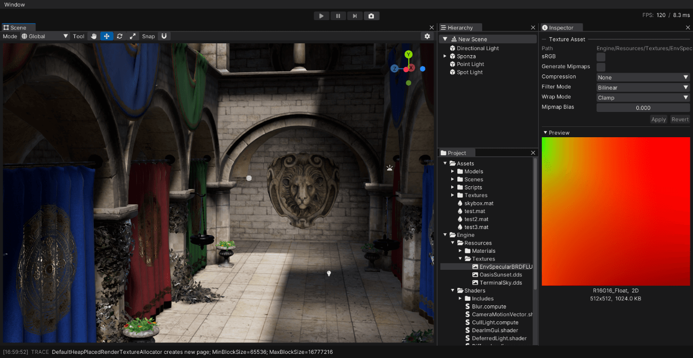

# March Engine

基于 Direct3D 12、C++17 和 .NET 9 的游戏引擎，用于学习引擎和图形技术，目前只支持 Windows x64。



该项目还有很多地方不够完善，很多实现也未必最优，但现在 <span style="font-size:1.5rem">准备找暑期实习（2026 年本科毕业）</span>，所以不得不公开这个仓库。

## 已实现的功能

### Scripting

- 使用 .NET 9 CoreCLR 以及 C# 13 实现上层逻辑
- 使用 Source Generators 自动生成 C# Binding
- 使用 C++ 模板实现了自定义的 Marshal 机制
- 利用 C# 实现部分 C++ 类型的反射

### Asset Pipeline

- 类似 Unity 的 `AssetImporter` 和 `AssetDatabase`
- 使用 [`FileSystemWatcher`](https://learn.microsoft.com/en-us/dotnet/api/system.io.filesystemwatcher) 监听资产变动
- 资产的内容发生变化，或者资产的依赖发生变化时，自动重新导入，实现资产热重载
- 支持资产拖拽赋值，拖拽实例化
- 默认支持 DDS、PNG、JPG、EXR、glTF 等资产

下面是一段示例代码，用于导入项目中的 hlsl 资产，并正确设置依赖关系。

``` csharp
[CustomAssetImporter("Shader Include Asset", ".hlsl", Version = 2)]
public class ShaderIncludeImporter : AssetImporter
{
    protected override void OnImportAssets(ref AssetImportContext context)
    {
        var asset = context.AddMainAsset<ShaderIncludeAsset>(normalIcon: FontAwesome6.FileLines);
        asset.Text = File.ReadAllText(Location.AssetFullPath, Encoding.UTF8);

        using var includes = ListPool<AssetLocation>.Get();
        ShaderProgramUtility.GetIncludeFiles(Location.AssetFullPath, asset.Text, includes);

        foreach (AssetLocation location in includes.Value)
        {
            context.RequireOtherAsset<ShaderIncludeAsset>(location.AssetPath, dependsOn: true);
        }
    }
}
```

### D3D12RHI

- 实现了一套类似 Unity SRP 的 D3D12RHI，屏蔽了 Descriptor / View / PipelineState / RootSignature 等底层细节

### Shader

### EditorGUI

- 使用 [Dear ImGui](https://github.com/ocornut/imgui) 和 C# 反射实现了编辑器 UI
- 使用自己封装的 D3D12RHI 重写了 ImGui 的 D3D12 Backend，解决了官方实现中只能使用一个 DescriptorHeap 的问题和无法在 Linear Color Space 渲染的问题
- 封装了类似 Unity 的 `EditorWindow`
- 支持绘制自定义的 Gizmos

### RenderGraph

### RenderPipeline

- PBR
- Physical Lights
- Hierarchical Z Buffer
- Clustered Deferred Shading
- SSAO
- TAA
- ACES Tonemapping
