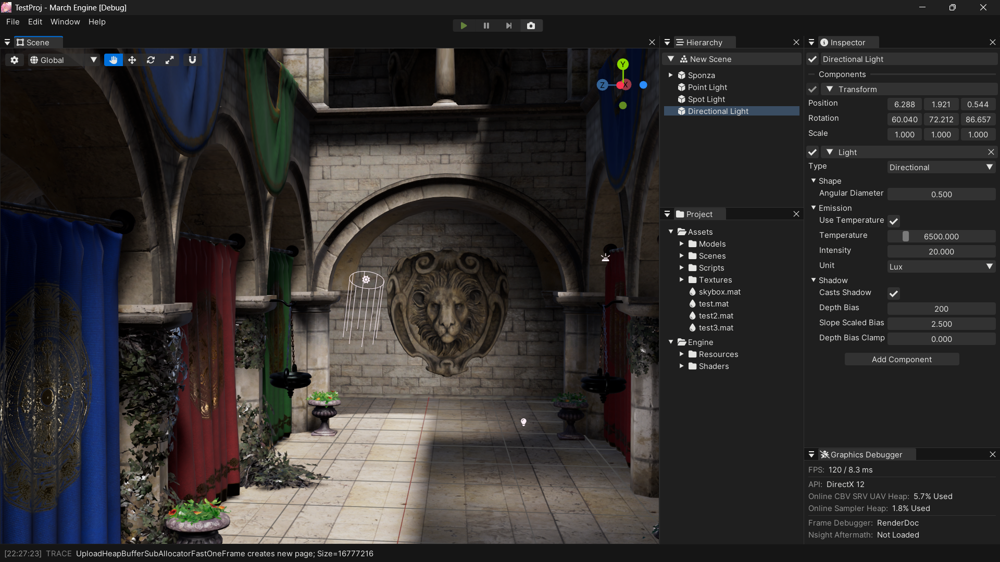
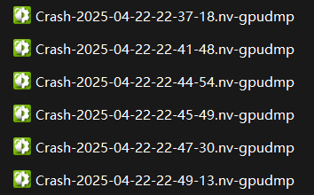
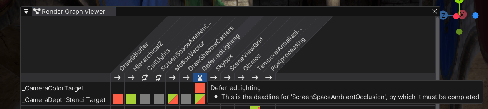
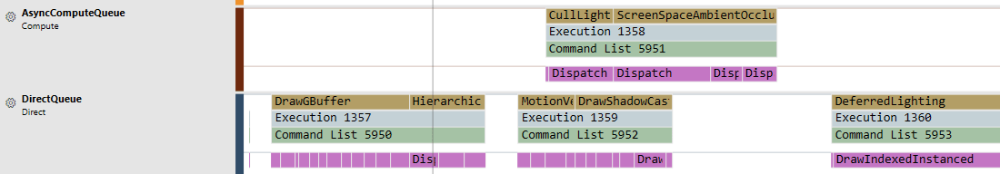

# March Engine

基于 Direct3D 12、C++17 和 .NET 9 的游戏引擎，用于学习引擎和图形技术，目前只支持 Windows x64。

<p align="center"></p>

<p align="center"></p>

## 文档

- [Build](Documentation/Build.md)
- [Conventions](Documentation/Conventions.md)
- [Asset Pipeline](Documentation/AssetPipeline.md)
- [Rendering](Documentation/Rendering.md)
- [Debugging Shaders](Documentation/DebuggingShaders.md)

## 已实现的功能

暂时不接受 pull requests。

### Build Tool

- 使用 Lua 配置 C++ 和 C# 项目
- 使用自己 Fork 的 [Premake](https://github.com/stalomeow/premake-core/tree/march-engine) 生成 IDE 项目文件，新增 Solution Items、Source Generators、Runtime Dependencies 等功能

### Scripting

- 使用 .NET 9 CoreCLR 以及 C# 13 实现部分上层逻辑
- 使用 Source Generators 自动生成 C# 侧的 Binding
- 使用 C++ 模板实现了自定义的 Marshal 机制
- 利用 C# 实现部分 C++ 类型的反射

### Asset Pipeline

- 类似 Unity 的 `AssetImporter` 和 `AssetDatabase`，`AssetImporter` 内部记录资产的弱引用，可以减少无用资产的内存占用
- 使用 [`FileSystemWatcher`](https://learn.microsoft.com/en-us/dotnet/api/system.io.filesystemwatcher) 监听资产变动，资产的内容发生变化，或者资产的依赖发生变化时，自动重新导入，实现资产热重载

下面是一段示例代码，用于导入项目中的 HLSL 资产，并正确设置依赖关系

``` csharp
[CustomAssetImporter("Shader Include Asset", ".hlsl", Version = 4)]
public class ShaderIncludeImporter : AssetImporter
{
    protected override void OnImportAssets(ref AssetImportContext context)
    {
        var asset = context.AddMainAsset<ShaderIncludeAsset>(normalIcon: FontAwesome6.FileLines);
        asset.Text = File.ReadAllText(Location.AssetFullPath, Encoding.UTF8);

        using var includes = ListPool<AssetLocation>.Get();
        ShaderProgramUtility.GetHLSLIncludeFileLocations(Location.AssetFullPath, asset.Text, includes);

        foreach (AssetLocation location in includes.Value)
        {
            context.RequireOtherAsset<ShaderIncludeAsset>(location.AssetPath, dependsOn: true);
        }
    }
}
```

### D3D12

- 实现了一套类似 Unity 的 D3D12RHI，屏蔽了 Descriptor / View / PipelineState / RootSignature 等底层细节
- 自动处理并合批 Resource Barrier，支持 Subresource 级别的状态管理
- 视锥体剔除 / 材质合批（类似 Unity SRP Batcher）/ 自动 GPU Instancing / 支持 Odd Negative Scaling
- 实现了 Linear Allocator 和 Buddy Allocator，并支持多种资源分配方式 Committed / Placed / Suballocation
- 基于 [ANTLR4](https://www.antlr.org/) 实现了 Unity 的 ShaderLab 并利用 Shader 的反射数据自动绑定资源
- 支持 `#pragma multi_compile` 创建 Shader 变体，每个 Shader 最多 128 个 Keyword，这也是 [Unity 推荐的上限](https://docs.unity3d.com/6000.0/Documentation/Manual/shader-keywords.html)
- Shader 也支持热重载，IDE 里修改后，回到引擎立即生效
- 支持在引擎启动时加载 [RenderDoc](https://renderdoc.org/) 或 [PIX](https://devblogs.microsoft.com/pix/introduction/)，点击编辑器上方的相机按钮就能截帧

### Crash Handling

- 集成了 [NVIDIA Nsight Aftermath SDK](https://developer.nvidia.com/nsight-aftermath)

<p align="center"></p>

在崩溃时，会有弹窗提示崩溃原因

- 如果是 CPU 代码导致的错误，在有调试器附加时，会自动在相关位置设置断点，方便检查问题
- 如果是 GPU 侧导致的错误，会在项目的 Logs 目录下生成 `nv-gpudmp` 文件，可以用 [NVIDIA Nsight Graphics](https://developer.nvidia.com/nsight-graphics) 打开来检查问题

<p align="center"></p>

可以直接定位问题到 Shader 的某一行

<p align="center"></p>

### Render Graph

- 自动计算资源的生命周期，并尽可能地复用资源
- 自动剔除没用的 Pass
- 支持 Async Compute
- 类似 Unity 的 RenderGraph 可视化

<p align="center"></p>

上图中的方块表示 Pass 对资源的读写情况

- 红色：Pass 会写入该资源
- 绿色：Pass 会读取该资源
- 灰色：该资源存活但 Pass 对它没有操作

Pass 名称下面的图标表示该 Pass 的类别

- 单箭头：普通 Pass
- 双箭头：Async Compute Pass
- 沙漏：某个 Async Compute Pass 的 Deadline
- 叉：Pass 被剔除

把光标放在图标上，可以显示详细信息

<p align="center"></p>

#### Example

下面是一段示例代码，用于生成 Hierarchical Z-Buffer

``` cpp
void RenderPipeline::HiZ()
{
    GfxTextureDesc desc{};
    desc.Format = GfxTextureFormat::R32G32_Float;
    desc.Flags = GfxTextureFlags::Mipmaps | GfxTextureFlags::UnorderedAccess;
    desc.Dimension = GfxTextureDimension::Tex2D;
    desc.Width = m_Resource.DepthStencilTarget.GetDesc().Width;
    desc.Height = m_Resource.DepthStencilTarget.GetDesc().Height;
    desc.DepthOrArraySize = 1;
    desc.MSAASamples = 1;
    desc.Filter = GfxTextureFilterMode::Point;
    desc.Wrap = GfxTextureWrapMode::Clamp;
    desc.MipmapBias = 0.0f;

    static int32 hizId = ShaderUtils::GetIdFromString("_HiZTexture");
    m_Resource.HiZTexture = m_RenderGraph->RequestTexture(hizId, desc);

    auto builder = m_RenderGraph->AddPass("HierarchicalZ");

    builder.In(m_Resource.DepthStencilTarget);
    builder.Out(m_Resource.HiZTexture);
    builder.UseDefaultVariables(false);

    builder.SetRenderFunc([this, w = desc.Width, h = desc.Height](RenderGraphContext& context)
    {
        context.SetVariable(m_Resource.DepthStencilTarget, "_InputTexture", GfxTextureElement::Depth);
        context.SetVariable(m_Resource.HiZTexture, "_OutputTexture", GfxTextureElement::Default, 0);
        context.DispatchComputeByThreadCount(m_HiZShader.get(), "CopyDepthMain", w, h, 1);

        for (uint32_t mipLevel = 1; mipLevel < m_Resource.HiZTexture->GetMipLevels(); mipLevel++)
        {
            context.SetVariable(m_Resource.HiZTexture, "_InputTexture", GfxTextureElement::Default, mipLevel - 1);
            context.SetVariable(m_Resource.HiZTexture, "_OutputTexture", GfxTextureElement::Default, mipLevel);

            uint32_t width = std::max(w >> mipLevel, 1u);
            uint32_t height = std::max(h >> mipLevel, 1u);
            context.DispatchComputeByThreadCount(m_HiZShader.get(), "GenMipMain", width, height, 1);
        }
    });
}
```

<p align="center"><del>斯巴拉西，真是太优雅了！</del></p>
<p align="center"></p>

#### Async Compute

调用下面的方法就能将 Pass 标记为 Async Compute，但这只是一个建议

``` cpp
builder.EnableAsyncCompute(true);
```

RenderGraph 会针对该 Pass 计算 Read Write Hazard 和并行程度，最后综合决定是否启用 Async Compute。

下面是 PIX GPU Capture 的结果

<p align="center"></p>

> Note that PIX on Windows does not currently overlap GPU work on different queues while analyzing timing in GPU Captures. Consider taking a Timing Capture if you want to see overlapping async compute timing data. In GPU Captures, if a game uses async compute to execute rendering and compute work simultaneously, then PIX will instead measure first one and then the other.  This may result in shorter reported durations for each part of the work compared to how it would execute inside the original game (due to reduced contention on the GPU) but a longer total time (due to reduced parallelization). [^1]

下面是 PIX Timing Capture 的结果

<p align="center"></p>

### Render Pipeline

- Linear Color Space Rendering
- Reversed-Z Buffer
- Octahedron Normal Encoding
- Normal Mapping
- Hierarchical Z-Buffer
- Clustered Deferred Shading
- Percentage-Closer Soft Shadow
- Lambertian Diffuse + Microfacet BRDF
- Directional / Point / Spot Light
- Physical Light Units: Lux / Lumen / Candela
- Correlated Color Temperature
- Screen Space Ambient Occlusion
- Motion Vector / Temporal Anti-aliasing
- ACES Tonemapping
- Skybox（Cubemap）
- Scene View 无限网格
- 基于 Spherical Harmonics 的 Diffuse 环境光，利用卷积的性质，只用一次积分就算出球谐系数
- 基于 Split-Sum Approximation 的 Specular IBL

### Editor

- 使用自己 Fork 的 [Dear ImGui](https://github.com/stalomeow/imgui/tree/march-engine) 实现编辑器 UI
- 利用 C# 反射自动绘制 Component Inspector
- 支持绘制自定义的 Gizmos
- 支持各种 Drag & Drop 操作
  - 引擎外的文件拖拽到 Project 窗口的文件夹上即可导入
  - 引擎内的资产可以通过拖拽进行赋值和实例化
  - Hierarchy 中的 GameObject 可以通过拖拽调整层级和顺序

### Misc

- 基于线程池的简易 JobSystem
- 基于 `IEnumerator` 的简易 Coroutine
- 主线程繁忙时，自动显示进度条，避免用户认为引擎卡死
- 提供多种对象池减少 GC 分配

[^1]: https://devblogs.microsoft.com/pix/gpu-captures/
